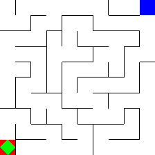
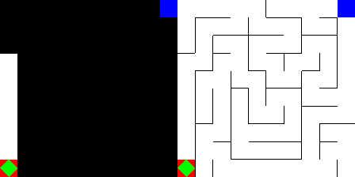
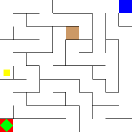

# maze-gym
A maze environment for training and evaluating agents. All mazes are (y, x) size and come with a set of functions.

```
save(path): save the current maze structure, start and finish. 
load(path): load a saved structure.
solve(mode): give solutions for the maze using deapth-first-search (DFS).
    mode: "all" - all possible solutions, "shortes" - one solution (the shortest)
```

---
## State

There are two possible state representations: vector and image.

### Vector example for a 3x3:
```python
state = [ 0.  0. 24.  0.  1.  0.  0.  0.  0.  1.  1.  1.  0.  0.  0.  0.  0.  0.
  1.  1.  1.  1.  0.  0.  0.  0.  0.  0.],
```
where the first position is the global position for the agent, the second position is the start global position and the third is the goal global position. 
The rest of the vector is the maze structure being `tile | wall | tile | wall`. 
If a wall value is 0, it means there are no walls there. 
If it is 1, it means there is a wall.
The global position means the position on the vector given in the state.
Thus, 24th means the last space in the vector.

### Image example for a 10x10:



---

## Settings

The maze comes with different settings, such as occlusions, door and key, teleports.

### Occlusion

In this setting the agent only has partial observations which always show the goal, the start and the agent field of view.
The same happens to the vector space. Where 0 will be the visible tiles and walls, while 1 are the non-visible ones.

In order to use ``occlusion`` when making the environment just use:
```python
env = gym.make("Maze-v0", occlusion=True)
```

#### Occlusion example




### Key and Door
In this setting the agent has to first grab a key, which is always outside of the path from the start to the end, to 
open the door. After grabing the key the door will not disappear and the agent has to walk on it to open.
In order to use the ``Key and Door`` task in the environment just use:
```python
env = gym.make("Maze-v0", key_and_door=True)
```
#### Key and Door example



### teleport

Under development

---

## Installing

Under development
