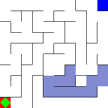

# Labyrinth
A labyrinth environment for training and evaluating agents. All labyrinths are (y, x) size and come with a set of functions.

```
save(path): save the current labyrinth structure, start and finish. 
load(path): load a saved structure.
solve(mode): give solutions for the labyrinth using deapth-first-search (DFS).
    mode: "all" - all possible solutions, "shortest" - one solution (the shortest)
```

---
## State

There are two possible state representations: vector and image.

### Vector example for a 3x3:
```python
state = [ 0.  0. 24.  0.  1.  0.  0.  0.  0.  1.  1.  1.  0.  0.  0.  0.  0.  0.
  1.  1.  1.  1.  0.  0.  0.  0.  0.  0.],
```
where the first position is the global position for the agent, the second position is the start global position and the third is the goal global position. 
The rest of the vector is the labyrinth structure being `tile | wall | tile | wall`. 
If a wall value is 0, it means there are no walls there. 
If it is 1, it means there is a wall.
The global position means the position on the vector given in the state.
Thus, 24th means the last space in the vector.

### Image example for a 10x10:


---

## Settings

The labyrinth comes with different settings, such as occlusions, door and key, icy floor.

### Occlusion

In this setting the agent only has partial observations which always show the goal, the start and the agent field of view.
The same happens to the vector space. Where 0 will be the visible tiles and walls, while 1 are the non-visible ones.

In order to use ``occlusion`` when making the environment just use:
```python
env = gym.make("Labyrinth-v0", occlusion=True)
```

#### Occlusion example


### Key and Door
In this setting the agent has to first grab a key, which is always outside of the path from the start to the end, to 
open the door. After grabing the key the door will not disappear and the agent has to walk on it to open.
In order to use the ``Key and Door`` task in the environment just use:
```python
env = gym.make("Labyrinth-v0", key_and_door=True)
```
#### Key and Door example


### Icy floor
In this setting the agent has to find a path to the goal without walking over ice. The ice will break if the agent steps into it.
If the agent steps into ice the episode will terminate and the agent receives -100 reward points. There will always be a path without ice.
In order to use the `Icy Floor` task in the environment just use:
```python
env = gym.make("Labyrinth-v0", icy_floor=True)
```

#### Icy floor example



---
## Creating a labyrinth from a file
Since the save file from a labyrinth contains only a list of nodes (edges, start, finish, etc.), I've created a way of "drawing" a map for the cases that we don't want to use the random creation.
To use it you can create your own file using the designed pattern, or call the function
```python
create_default_labyrinth(size: Tuple[int, int], path: str)
```

The function will create a file at `path` with the parameter `size` like this:

```
"""
This file was created automatically.
For more instructions read the README.md
"""
key_and_lock: False
icy_floor: False
occlusion: False

labyrinth:
---------------------
|   |   |   |   | E |
| - + - + - + - + - |
|   |   |   |   |   |
| - + - + - + - + - |
|   |   |   |   |   |
| - + - + - + - + - |
|   |   |   |   |   |
| - + - + - + - + - |
| S |   |   |   |   |
---------------------
end
```

where `|` are vertical walls, `-` are horizontal walls and `S` is the starting , `E` is the end, `I` is ice floor, `K` is the key `D` and door positions. 
If you want to remove a wall, just need to leave it blank.
For example:

```python
-------------  
|   |     E |  # ['6', '|', '7', ' ', '8']
| - +   + - |  # ['-', '+', ' ', '+', '-']
|       |   |  # ['3', ' ', '4', '|', '5']
|   + - +   |  # [' ', '+', '-', '+', '-']
| S |   |   |  # ['0', '|', '1', '|', '2']
-------------    
```

which creates the path `0 -> 3 -> 4 -> 7 -> 8`.
By default there is no ice or key and door on the generated labyrinth, but you can change it to have by adding `I` (for ice floors) or `K` and `D` (for key and door).
After creating the labyrinth you should use:

```python
convert_from_file(structure_file: str, path: str)
```

which creates a file that the environment can load, for example:

```python
structure, variables = convert_from_file("structure_test.labyrinth")
env = gym.make("Labyrinth-v0", shape=(3, 3))
env.load(structure, variables)
```

## Saving a labyrinth into a file

To save a labyrinth into a file, you just have to:
```python
from labyrinth.file_utils import create_file_from_environment

env = gym.make("Labyrinth-v0", shape=(3, 3))
env.reset()
create_file_from_environment(env, "test.labyrinth")
```

## Installing

For now, we only support installing from source.
To install it, you just need to execute the following commands in your terminal:

```bash
git clone https://github.com/NathanGavenski/labyrinth-gym
cd labyrinth-gym
pip install -e .
```


## TO DO
* [x] Migrate to gymnasium
* [ ] Make it work with python 3.12
* [ ] Create unit tests for the dataset and labyrinth scripts
* [ ] Update gifs
